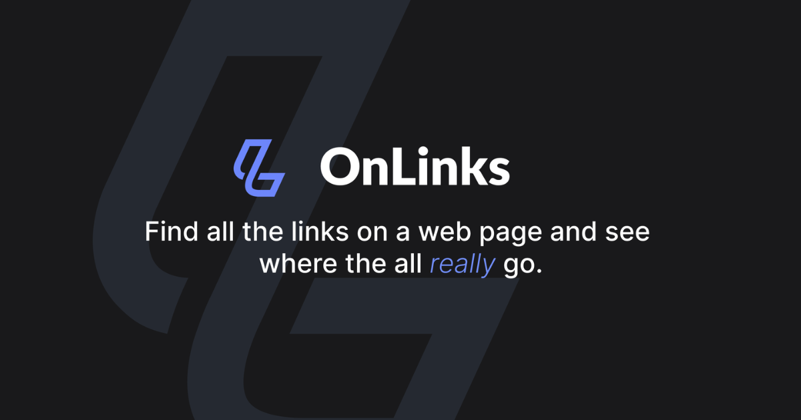

# 👋 OnLinks



---

## 🚀 Where to install

This extension is available on:

- [Chrome Web store](https://chrome.google.com/webstore/detail/onlinks/bdoiohafhhpldalpekdahlmhbnckanka)
- [Firefox Addon Marketplace](https://addons.mozilla.org/en-US/firefox/addon/onlinks/)
- [Microsoft Edge Add-ons Marketplace](https://microsoftedge.microsoft.com/addons/detail/onlinks/)

---

A browser extension for gathering, organizing, and inspecting all the links on a
web page.

## Local development

Before making edits you will need to build the extension locally and side load
it as a developer extension to test any changes.

> At the moment, v3 and v2 manifest API conflicts are making things difficult.
> The Rollup config programmatically compiles two different versions depending
> on the manifest. For Chrome, the v3 manifest in the `dist` folder is the one
> to load. For Firefox, you will need to build and load the zipped release
> version with `yarn release`.

### 1. Clone the repo

Clone the repo to your local machine and navigate into the root directory.

```shell
cd onlinks
```

### 2. Install dependencies

Onlinks uses yarn to build the necessary dependencies.

```shell
yarn
```

### 3. Start and watch a build

For development with automatic reloading:

```bash
yarn start
```

This will build to the `dist` folder. To load the extension, open the Extensions
Dashboard, enable "Developer mode", click "Load unpacked", and choose the
`dist/v3-manifest` folder.

When you make changes in src the background script and any content script will
reload automatically.

### 4. Start the server

You'll need to start up the server to make fetch calls and check statuses. To build content from the `src/api` folder, run:

```bash
yarn watch
```

This will startup the server and restart it any time a change is recompiled from rollup.
